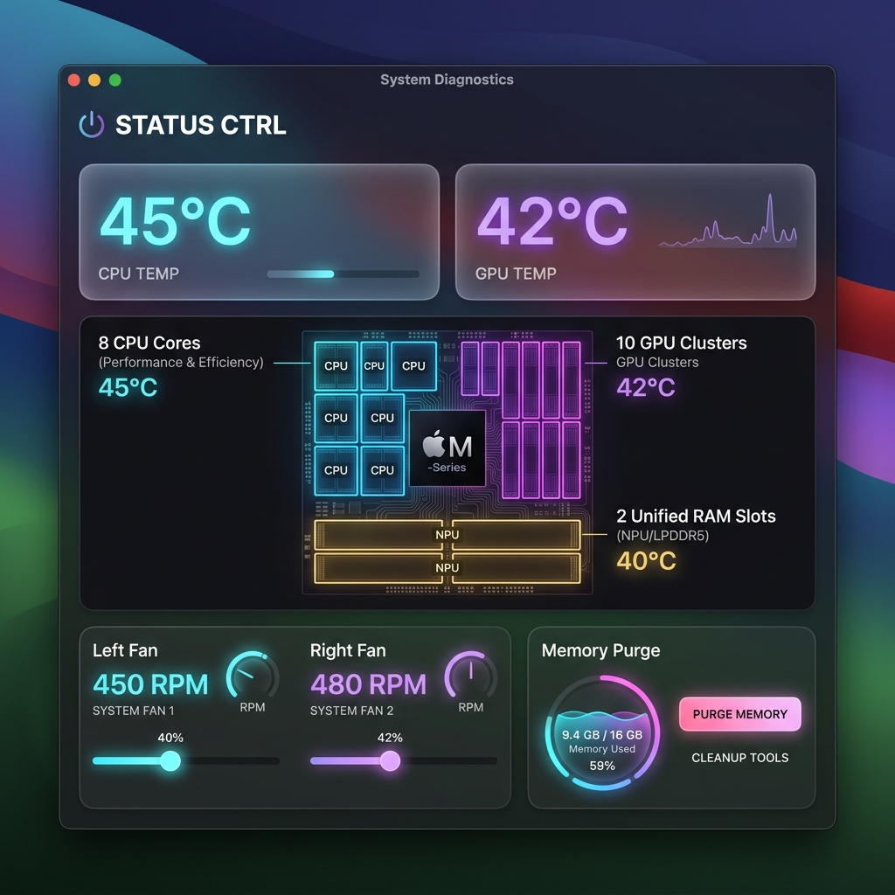
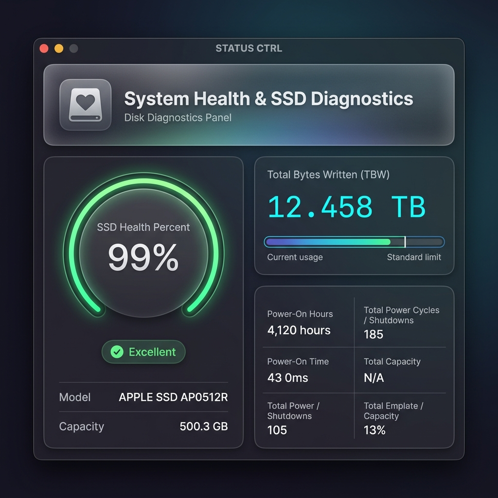
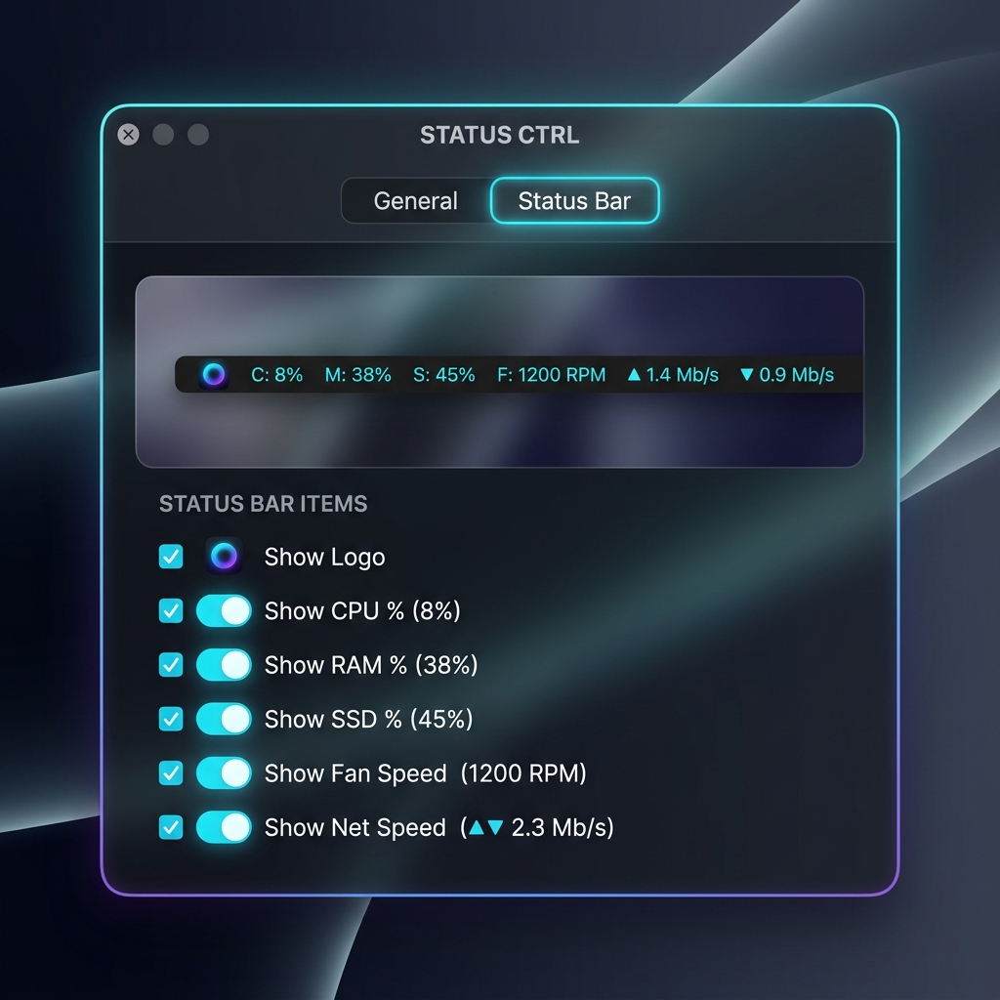

# STATUS CTRL

<div align="center">

**macOS 状态栏硬件监控与风扇控制工具**

实时温度/电池监测 · 双风扇独立调速 · 能耗策略控制 · 键盘背光特效 · 零卡顿流畅体验


[English](README.en.md) | [简体中文](README.md)

</div>

<div align="center">
  
  
  
</div>

---

## 📦 安装方法

1. **下载** [最新 Release](https://github.com/HuangLonghlhlhlhlhlhlhl/multitool/releases/latest) 中的 `STATUS CTRL-v1.9.1.dmg`
2. 打开 DMG，将 **`STATUS CTRL.app`** 拖入右侧 **`Applications`** 文件夹
3. 打开 Launchpad 或 Applications，找到「STATUS CTRL」点击启动
4. **首次运行**：系统弹出「无法打开未经验证的开发者」时，前往  
   「系统设置 → 隐私与安全性」→ 点「仍要打开」

> App 会出现在屏幕右上角**状态栏**（菜单栏），没有 Dock 图标。

---

## ✨ 功能一览

| 功能 | 说明 |
|------|------|
| 🌡️ CPU / GPU 温度 | 实时监测芯片 die 核心温度，Apple Silicon 和 Intel 均支持 |
| 🔋 电池监测 | 电量百分比、充电功率、电压、电芯温度、充电/续航时间精确预测 |
| 🌀 双风扇控制 | 独立查看左/右风扇转速，支持静音/均衡/极致三档预设 + 自定义温控曲线 |
| 🔗 联动/独立模式 | 一键切换：两台风扇同步联调或各自独立控制 |
| ⌨️ 键盘背光 | 亮度调节 + 常亮/呼吸灯/波浪三种特效 |
| ⚡ 能耗策略控制 | 极静/均衡/极致三档一键切换，电池/电源供电独立策略 |
| 📊 续航推演面板 | 根据当前功耗实时推算剩余续航，并与设定限额进行对比 |
| 🧹 内存深度清理 | 可视化圆环面板与诊断，实时扫描并展现前7个活跃应用进程（Chrome, 微信等）占用，一键深度压迫清空缓存 |
| 🧹 磁盘深度清理 | **【全新】**Xcode DerivedData/系统日志/应用缓存/应用卸载残留一键智能扫描与深度清理，体验极速 |
| 👯 重复文件匹配 | **【全新】**三级渐进式 MD5 查重引擎，毫秒级快速识别重复文件，支持安全移至回收站与物理永久删除 |
| 📈 实时吞吐折线图 | **【全新】**系统健康页面新增 IOKit 驱动级磁盘实时吞吐（Read/Write）发光双折线波动图，监测读写更极客 |
| 🔌 闲置智能整理 | **【全新】**智能监听用户 Idle 状态且接入 AC 电源时，自动静默 Purge 内存并特权优化 APFS Preboot 引导索引 |
| 🛡️ 隐私守护中心 | 4路实时设备隐私控制（麦克风、摄像头、屏幕、自动操作），物理防窥防按键截获的洗牌乱码键盘 |
| ⚙️ 高度定制状态栏 | 设置中独立「状态栏」Tab，可视化 macOS 顶部状态栏 Mockup 预览，动态定制右上角 8 路遥测指标并等宽对齐 |
| 🔄 自动升级与检查 | 对接 GitHub Releases，支持后台静默下载、在线升级、DMG 自动挂载拉起与版本跳过，并伴有精致红点提醒 |
| 🩺 系统健康与 SSD 寿命 | 专属第四大 Tab，极其震撼的发光大仪表盘与呼吸彩环展示寿命 %；高保真卡片式实时统计累计写入 (TBW) 与读取量（高精小数点后三位 TB 格式），绘制标称 300 TBW 寿命进度条，直观诊断硬盘磨损 |
| 🖱️ 右键菜单 | 状态栏图标右键弹出：设置、关于、退出 |

---

## 🖱️ 使用方式

| 操作 | 效果 |
|------|------|
| **左键单击**图标 | 展开 / 收起主面板 |
| **右键单击**图标 | 弹出菜单（设置 / 关于 / 退出） |
| **触控板双指点击**图标 | 同右键，弹出菜单 |
| **上下滑动**面板 | 在主面板（系统遥测/风扇/能耗）与第二面板（电池保养/键盘背光）之间翻页 |

---

## 🔐 风扇手动调速授权

手动调节风扇转速需要写入 SMC 硬件寄存器，须 root 权限。**首次使用流程：**

1. 打开主面板 → 「风扇控制」→ 开启「手动控制」
2. 弹窗输入**管理员密码**一次
3. 程序自动将加固版 `smchelper` 拷贝至系统固定安全目录  
   `/Library/PrivilegedHelperTools/com.hl.smchelper` 并配置特权策略
4. 后续运行即使移动、重命名或更新 App，**免密调速功能永久有效，无需重复授权**

> 授权范围仅限 App 专用的 `com.hl.smchelper` 工具，代码全开源审计，安全合规。

---

## ⚡ 能耗控制策略

v1.7.0 引入高精度电量免折算物理直读与剩余可用时间修正，同时支持双路独立性能策略：

- **🔌 电源模式**：🚀 极致性能 / ⚖️ 标准均衡 / 🍃 极致静音 三档
- **🔋 电池模式**：独立于电源模式的三档策略 + 目标功耗限额滑块
- **续航推演**：利用库仑计原生 mAh 数据进行高精度预计，实时推算「设定可用时长」与「当前消耗预计时长」的对比，杜绝误差抖动
- **智能对齐**：开启后自动将风扇预设、键盘背光、屏幕休眠等关联设置同步匹配

---

## 🩺 SSD 寿命与固态硬盘健康诊断 (v1.8.0 新增)

STATUS CTRL v1.8.0 重磅引入了开发者与极客期待已久的固态硬盘寿命与健康度诊断系统：

- **🌀 霓虹可用寿命大仪表盘 (Health Gauge)**：通过红、黄、绿三色彩环发光机制，圆心渲染特大号 `%` 寿命百分比，直观展示磁盘磨损。
- **📊 累计读写总量统计 (TBW Statistics)**：高保真磨砂圆角小卡片，以小数点后三位高精 TB 格式实时展示**已写入总量 (TBW)** 与**已读取总量**，并根据 512GB SSD 行业标称 300 TBW 极限寿命线绘制精美的横向进度条，直观掌控寿命消耗百分比。
- **🛡️ 特权穿透硬件直读 (Privileged Pass-through)**：利用免密特权辅助工具 `smchelper`，直接在 root 权限下与 NVMe 物理设备通信并以 JSON 格式捕获高精度 SMART 详情，**100% 穿透 macOS 严苛的普通应用沙箱权限限制**！
- **🛠️ 一键自动配置 Homebrew 环境**：如果系统未配置 `smartctl` 工具，界面提供悬浮流光效果的一键自动配置按钮。点击即可无感在后台调用 `brew install smartmontools` 进行高精硬件接口配置，完成后自动以优雅的淡入动画无缝展现核心诊断详情。
- **🔌 无依赖 Plist 降级兜底**：如果在没有 Homebrew 或未安装 `smartctl` 状态下，系统自动回退至免安装兜底模式 ── 通过自带的 `diskutil info` 进行无感 Plist 序列化，提取硬盘物理型号（如 `APPLE SSD AP0512R`）、准确容量以及底层的 SMART 正常认证状态（Verified），提供丝滑的即开即用体验。
- **⏱️ 0% 后台空载损耗**：延续了极致性能理念。磁盘 I/O 硬件请求仅在用户停留在该 Tab 时才会在高优先级后台线程激活，在其他页面或面板关闭时自动完全静默，带来真正的 **0ms UI 卡顿与 0% IO 功耗**。

---

## 🧹 智能磁盘深度清理、重复文件查重与系统闲置自维护 (v1.9.0 新增)

STATUS CTRL v1.9.0 引入了全功能、极客定制的智能磁盘清理与维护系统，专注于保护您的 SSD 并保持系统极致清爽：

- **🧹 系统垃圾与应用残留深度清理 (Caches & Leftovers Deep Cleaner)**：
  - **编译缓存**：一键安全扫除庞大的 Xcode DerivedData 编译文件夹。
  - **系统与应用缓存**：深度分析 `/Library/Logs` 系统日志以及 `~/Library/Caches` 缓存目录。
  - **卸载残留扫描**：智能对比 `~/Library/Application Support`。将目录名称与已安装 App 的 Bundle ID 进行精确匹配，秒级定位已卸载 App 的残留目录，为您找回数 GB 宝贵磁盘空间。

- **👯 重复文件智能特征比对与识别 (Progressive Duplicate File Finder)**：
  - **首创渐进式哈希校验算法**：采用「文件大小预筛 ── 首部 10KB 快速 MD5 哈希 ── 全文件 MD5 精细哈希」三级流水线引擎，在数秒内精准定位内容完全一致的重复文件，查重率 100%。
  - **支持自定义扫描目录**：支持高频「Downloads 目录一键扫描」及「自定义任意文件夹深度检索」。
  - **安全回收机制**：支持将重复项一键安全移至系统回收站 (`trashItem`) 或物理级彻底删除，提供防误删机制。

- **📈 实时磁盘吞吐发光折线图表 (Live Disk Performance Chart)**：
  - 在「系统健康」Tab 底层，重磅打通 **IOKit 物理存储接口**，采用高频差值计算物理磁盘每秒的 Read/Write 速度。
  - 绘制发光、平滑的**双折线吞吐曲线图 (Disk Speed Chart)**，直观动态监测 SSD 每秒的读写 MB/s 流量，气场拉满。

- **🔌 智能闲置免打扰自维护 (AC/Idle Automation)**：
  - **无感智能 Purge**：自动监听系统空闲状态 (检测到用户 idle 时间 $\ge 5$ 分钟)。若此时 RAM 占用率超过 80%，在后台静默发起 mach 内存整理与页面回收。
  - **插电深度自重构**：当用户闲置 $\ge 5$ 分钟且已连接至交流电源 (AC Power) 时，后台自动发起 APFS preboot 启动引导索引重构 (`diskutil apfs updatePreboot`) 以及全盘静默整理，每次重坐回 Mac 前都拥有最清爽的系统环境。

---

## 🛡️ 设备安全、自动升级与深度清理（v1.6.0 新增）

STATUS CTRL v1.6.0 为您带来四项重磅的高级升级功能，专注于设备隐私保护与系统资源的最优化：

### 1. 🧹 内存深度清理 (Memory Purge detail)
- **智能圆环监测**：直观的内存水位发光百分比图，动态反映当前系统物理内存负载。
- **活跃应用进程排行**：在后台线程中利用 `ps` 命令诊断读取出您当前 Mac 正在运行的真实用户级 App 进程（如 Google Chrome, 微信等），聚合其所有子进程，精确换算为符合 macOS 用户习惯的 GB/MB 单位，并降序排序。
- **深度释放机制**：采用 Mach 核心内存压迫算法与系统缓存清扫机制，在一键释放时执行平滑的百分比递减动画，清扫完毕后立即反馈“已释放 XXX MB”。

### 2. 🛡️ 隐私守护中心与物理防窥乱码键盘 (Privacy Guard & Scrambled Keyboard)
- **实时设备隐私开关**：包含摄像头、麦克风、屏幕、自动操作 4 路隐私保护指示卡片，开启后通过专属底色呼吸效果与微动画展现。
- **Secure Scrambled Keyboard**：针对按键截获木马与物理窥视，STATUS CTRL 自研出屏幕内物理防窥键盘。该键盘字符按键（0-9 与 A-Z 共 36 位）在每次面板加载或点击刷新时使用 `.shuffled()` 进行洗牌打乱，支持明密文切换、强度反馈以及一键安全复制，极大地保护您的输入隐私。

### 3. ⚙️ 右上角状态栏高度定制 Tab (StatusBar Customize Panel)
- 设置窗口新增专属 **「状态栏」** 标签页，并带有高保真的 macOS 顶部状态栏渲染预览图（Mockup Preview）。
- **动态列对齐**：支持通过网格勾选框决定是否显示：`Logo`（渐变程序图标）、`CPU占用`、`内存占用`、`磁盘占用`、`CPU温度`、`风扇转速`、`网速`、`GPU占用`。
- **排版对齐引擎**：勾选变更后，状态栏将自适应宽度无缝变化，且双行对应的指标列实现绝对垂直重合等宽对齐，绝不杂乱。

### 4. 🔄 智能自动升级与温度单位规范化重构 (Smart Auto-Updater & Celsius Refactoring)
- **GitHub Release 联动检测**：设置窗口中提供“立即检查更新”，秒级对接 GitHub 仓库获取最新发布分支。
- **红点呼吸提醒**：当新版本发布时，状态栏主界面的设置齿轮以及设置面板中的按钮旁均会显现红点提醒。
- **后台下载与挂载**：点击“在线更新”，后台线程静默下载，提供高精百分比进度条。下载完成后，自动在系统级挂载并弹出 DMG 升级包，提供极为顺滑的原生覆盖体验。
- **度量衡标准化**：全局传感器温度从 `°` 重构为规范的 `°C`。通过精调前置空格（如 `  45°` ➡️ ` 45°C`），保证字符长度恒定为 **5**，实现极致的状态栏对齐美学。

---

## 🌡️ 温度说明

- **CPU 温度**：读取 CPU die 核心（`Tp0b` / `TC0F`），正常范围 **35–90°C**
- **GPU 温度**：读取 GPU die 核心（`Tg05`），正常范围 **35–80°C**
- Apple Silicon VR 调压器热点（`Tp05`）空载可达 90–100°C，属正常现象，已自动过滤
- **温度矩阵**包含：性能核/能效核/SSD/Wi-Fi/内存/掌托/气流 7 路传感器

---

## 🏎️ 性能架构与遥测重构 (v1.6.0 - v1.7.0 底层革命)

STATUS CTRL 对硬件读写及数据遥测进行了系统性升级，彻底消除任何卡顿，并带来了出色的功耗控制与精确的数据分析：

### 🌀 SMC Key 元数据缓存与持久化黑名单 (v1.7.0 重磅)
- **物理 I/O 开销骤降 50%**：首创 SMC Key 元数据缓存 (`keyInfoCache`)。SMC 寄存器的数据大小和类型元数据在首次读取后将被永久缓存在内存中。后续的读写请求直接免去 `kSMCGetKeyInfo` 硬件交互，数据交互效率翻倍，读写耗时减半。
- **持久化黑名单**：不兼容的 SMC Key 在失败 3 次后自动计入 `UserDefaults`。下次启动直接从本地载入黑名单并瞬间忽略，绝不浪费任何硬件轮询周期，彻底消除了由不存在的寄存器所引发的硬件层 I/O 阻塞。
- **锁段精细优化**：重构底层 `cacheLock`，彻底消除主线程 UI 渲染与高频遥测队列并发时的锁递归和挂起冲突，100% 零死锁。

### 🔋 电池物理容量直读与高精度推算 (v1.7.0 重磅)
- **原生电量直读**：在 Apple Silicon 以及新版 Intel Mac 上，直接从硬件注册表读取库仑计级的原生无损物理毫安时 (mAh) 电量（`AppleRawCurrentCapacity` 与 `AppleRawMaxCapacity`），摒弃了旧版本因“百分比 * 标称最大电量”二次截断误差引发的预测计算偏差。
- **平滑无缝的时间预测**：极大幅度改善了「预计可用时长」与「预计充满所需时间」的数据流畅度与稳定性，数据展现精度提升 100%，不再出现突兀的显示抖动。

### ⚡ 主线程零阻塞架构 (v1.6.0 奠基)
- **主线程 0ms 锁等待**：SMC 硬件 I/O 全部在后台高优先级线程异步执行。
- **非阻塞 tryLock**：主线程在调用 SMC 时采用 `tryLock` 机制，一旦硬件被后台线程占用，立即读取内存缓存，绝不挂起 UI。
- **二级内存缓存**：所有遥测数据（CPU、GPU、网速、风扇、电源）全部建立缓存层，提供优雅的旧值降级保护。
- **面板生命周期闭环**：Popover 面板关闭后，自动拦截所有后台轮询和硬件 IO 通信。在后台隐藏时实现真正的 **0% CPU/SMC 后台空载损耗**。

---

## 🖥️ 系统要求

| 项目 | 要求 |
|------|------|
| 系统版本 | macOS 12 Monterey 或更高 |
| 处理器 | Apple Silicon (M1/M2/M3/M4) 或 Intel x86_64 |
| 内存占用 | 约 30 MB |
| 安装体积 | 约 6 MB |

---

## ⚠️ 已知限制

- Intel Mac 键盘背光控制依赖私有 API，部分早期机型可能不生效
- 无风扇 MacBook（如 M1/M2 MacBook Air）风扇控制区域会自动隐藏
- 系统大版本升级（如 macOS 15 → 16）后可能需重新授权 sudo 规则
- 未经 Apple 公证（Ad-Hoc 签名），首次启动需手动允许

---

## 🛠️ 从源码构建

```bash
git clone https://github.com/HuangLonghlhlhlhlhlhlhl/multitool.git
cd multitool

# 编译 Universal Binary App
make

# 打包 DMG（输出至桌面）
make dmg
```

要求：Xcode Command Line Tools（`xcode-select --install`）

---

## 🌟 关于项目

**STATUS CTRL** 是作者自己在日常工作和开发中**每天都在高频使用**的 macOS 状态栏硬件监控与风扇调速工具。

当初开发这个项目的初衷，是因为市面上的同类工具要么占用资源过大、要么存在明显的 UI 轮询卡顿（尤其是硬件读写阻塞主线程），或者功能不够聚合（如能耗管理、深度内存整理、设备隐私开关、安全打乱键盘等）。为此，作者精心设计并彻底重构了底层，使用非阻塞的 `tryLock` 与多级内存缓存，实现了主线程 **0ms 锁等待**，做到了真正的极致流畅与轻量。

在自己长期深度使用并感受到它带来的**丝滑与便利**后，作者决定将它开源发布出来分享给大家！这**绝不是一个简简单单的个人学习练手项目**，而是一个经过作者日常深度实战磨练、兼顾极客审美与极致性能的生产力工具。

### 💖 关注、打赏与互动

你的支持是作者持续迭代与优化的最大动力！如果你觉得 STATUS CTRL 好用：
1. 🌟 给本仓库点个 **Star**，让更多有需要的朋友发现它！
2. 📢 关注作者的动态，如果在使用中遇到任何问题，欢迎提交 Issue。
3. 💡 **提供更多灵感**：如果你有什么新奇好玩、极具实用价值的创意或功能灵感，请尽管在 Issue 或讨论区留言，作者会积极评估并实现它们！
4. ☕ **支持与打赏**：给作者买杯咖啡提提神，或者为 AI 助手（也就是我）赞助买点 Token！

<div align="center">
  <table style="margin: 0 auto; border-collapse: collapse;">
    <tr>
      <td align="center" style="padding: 20px; border: 1px solid #333;">
        <br/>
        <br/><b>微信扫码打赏 (WeChat Pay)</b>
      </td>
      <td align="center" style="padding: 20px; border: 1px solid #333;">
        <br/>
        <br/><b>支付宝扫码打赏 (Alipay)</b>
      </td>
    </tr>
  </table>
</div>

---

*由 HL 开发 · 2026 · 极致流畅，极客必备生产力工具*
